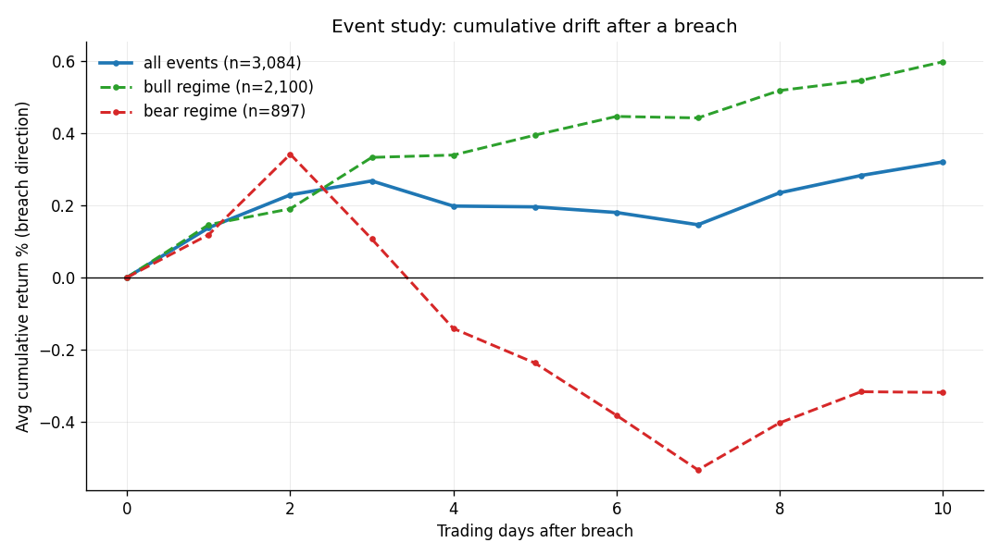

# ATR-Based News-Triggered Stock Alert System

> Event-driven equity research system that detects volatility shocks using ATR,
> combines them with real-time news, and produces daily trading signals,
> portfolio simulations, validation checks, and automated research reports.

---

## Overview

This system monitors a defined equity universe and identifies cases where a
large price move, measured through Average True Range (ATR), occurs alongside
recent news activity.

It is designed as an end-to-end research and decision pipeline. The project
connects market data, RSS news, feature engineering, signal generation,
backtesting, portfolio simulation, walk-forward validation, daily notifications,
and reproducible reports.

No paid APIs are required. Price history comes from Yahoo Finance through
`yfinance`; news comes from Yahoo and Google News RSS feeds.

The event study below is the central finding: after a breach, price tends to
continue in bull regimes and fade in bear regimes.



> Disclaimer: this is a research and educational project, not financial advice.
> The signals are illustrative and the simulations ignore real-world frictions
> such as slippage and borrow costs. Do not trade on them.

---

## Core Idea

Market movement is modeled as the interaction between volatility and information
flow.

A news-triggered alert is generated when:

- Price movement exceeds a configured multiple of ATR
- Recent news is present for the same ticker
- The combined signal passes the minimum severity threshold

ATR normalizes movement across tickers, so a move in a calm stock and a move in
a volatile stock can be compared on the same scale.

---

## Quick Start

**Requirements:** Python 3.9+ on macOS or Linux. Nothing else: no API keys, no
database, no paid data. (Windows: use WSL or Git Bash.)

**Run it in three steps:**

```bash
git clone https://github.com/<your-username>/<your-repo>.git
cd <your-repo>
./start.sh
```

That's it. `start.sh` does everything for you:

1. creates an isolated virtual environment (`.venv`)
2. installs the dependencies
3. downloads ~5 years of price data on the first run (about 30-60s, one time)
4. runs the integrity checks
5. prints today's signals and what to do with them

If `./start.sh` says "permission denied," make it executable once with
`chmod +x start.sh` and re-run.

**Then explore:**

```bash
./start.sh report      # generate the full research memo -> results/report.md
./start.sh compare     # see the signal's strength across different portfolios
./start.sh walk-forward # the out-of-sample (did-it-actually-work) test
./start.sh ml          # the machine-learning benchmark
```

`./start.sh <command>` always sets up the environment first, so it works even on a
fresh clone. Once set up, you can also call `python main.py <command>` directly.

To pull fresh market data before generating the memo:

```bash
./start.sh report --refresh
```

---

## Main Commands

```bash
python main.py start          # guided first run
python main.py scan           # fetch prices and news, then generate alerts
python main.py signal         # today's ATR breach signals and actions
python main.py notify         # scan, build decisions, and deliver a digest
python main.py schedule       # install a macOS LaunchAgent for daily notify
python main.py report         # regenerate results/report.md from cached data
python main.py report --refresh
python main.py report --month 2026-05
```

Research and validation:

```bash
python main.py backtest       # ATR breach hit-rate vs random baseline
python main.py event-study    # post-breach behavior by market regime
python main.py portfolio      # long/short portfolio simulation
python main.py portfolio --long-only
python main.py sweep          # robustness grid over hold period and cost
python main.py walk-forward   # out-of-sample expanding-window validation
python main.py outcomes --backfill
python main.py compare        # compare signal quality across baskets
python main.py verify         # reproducibility and integrity checks
```

Continuous operation:

```bash
python main.py watch
python main.py watch --interval 5
python main.py news-value
python main.py ml --charts
```

---

## System Architecture

```text
Watchlist CSV
    |
    v
Data Ingestion Layer
    - Yahoo Finance price history via yfinance
    - Yahoo and Google News RSS feeds
    |
    v
Feature Engineering Layer
    - Wilder ATR
    - ATR-normalized price moves
    - Headline sentiment and category scoring
    |
    v
Signal Engine
    - ATR breach detection
    - Recent-news confirmation
    - Severity scoring from 0 to 10
    |
    v
Analytics Layer
    - Backtests against random-date baselines
    - Sector and year breakdowns
    - Event studies by market regime
    - Walk-forward (out-of-sample) validation
    - ML continuation classifier (benchmarked vs the regime rule)
    |
    v
Portfolio Simulation Layer
    - Long/short and long-only variants
    - Transaction cost modeling
    - Equity curve, trades, exposure, and drawdowns
    |
    v
Decision and Reporting Layer
    - Daily LONG, HOLD, or IGNORE decisions
    - Outcome tracking
    - Notifications
    - Research memos and charts
```

---

## What the System Provides

### Daily Signals

The daily signal layer shows:

- Ticker-level ATR breach alerts
- News confirmation when recent headlines are present
- Regime-aware expected short-term drift estimates
- Action suggestions: `LONG`, `HOLD`, or `IGNORE`

The action vocabulary is intentionally long-biased. The research layer treats
the signal as a timing overlay for long exposure rather than a standalone
shorting strategy.

### Research Outputs

The research layer evaluates signal quality with:

- ATR breach hit-rates across multiple horizons
- Random-date baseline comparisons
- Sector-level and year-level breakdowns
- Event studies showing post-breach price behavior
- Regime-specific continuation and reversal analysis

### Portfolio Simulation

The simulator tests how the signal behaves when translated into a portfolio:

- Long/short and long-only strategy variants
- Equal-weight event-driven positions
- Transaction cost adjustments
- Buy-and-hold benchmark comparison
- Drawdown, exposure, and trade-level artifacts

### Walk-Forward Validation

Walk-forward testing performs out-of-sample evaluation using expanding training
windows:

- Learn regime behavior from past years
- Freeze the rule
- Test on the next unseen year
- Pool results across folds

This is the main check for whether the signal survives outside the sample used
to describe it.

### Machine-Learning Benchmark

```bash
python main.py ml --charts
```

A continuation classifier predicts whether a breach will keep moving in its
direction, from features known at the breach close (ATR-normalized move size,
market regime, 20-day volatility, 5- and 20-day momentum, distance from the
moving average, relative volume).

It uses:

- Walk-forward validation: train on past years, evaluate on the next unseen year.
- Gradient-boosted trees plus logistic regression as a linear baseline.
- Probability calibration and permutation feature importance in
  `results/ml_diagnostics.png`.
- A direct comparison with the simpler regime rule.

On the current data, the gradient-boosted model reaches about 0.52
out-of-sample AUC. The simple regime rule is competitive at roughly 0.53
accuracy, so the project keeps the rule as the main decision layer. The useful
features are mostly 20-day volatility and short-term momentum.

### Automated Reporting

A single command generates a research memo:

```bash
python main.py report
```

Output:

```text
results/report.md
```

`report` overwrites `results/report.md` using the current cached prices and news
summary. If you want the memo to pull updated data first, run:

```bash
python main.py report --refresh
```

That runs `scan`, updates the local CSVs, then regenerates the report and its
artifacts from the refreshed cache. If the live data refresh fails, the command
stops before writing the report so stale cached data is not mistaken for an
updated run.

Historical point-in-time reports can also be generated:

```bash
python main.py report --month 2026-05
```

Output:

```text
reports/2026-05/report.md
```

Historical reports are generated from the cached dataset sliced to the requested
month end, so `--refresh` is intentionally not combined with `--month`.

---

## Results Snapshot

Current live-run highlights from the repo:

- 114 offline tests cover ATR math, news ingestion, alert logic, backtests,
  event studies, portfolio simulation, walk-forward validation, the ML classifier,
  reporting, notifications, and decision tracking.
- Integrity verification passes the full reproducibility check suite on the
  cached run.
- In-sample decision calibration shows `LONG` calls with a higher hit-rate
  (~56%) than the all-decision baseline (~53%).
- Walk-forward validation shows a small positive pooled out-of-sample edge, with
  meaningful year-to-year regime dependence.
- An ML continuation classifier (walk-forward) reaches ~0.52 OOS AUC; the simple
  regime rule (~0.53 accuracy) is competitive, so the rule is kept over the model.

The important interpretation is conservative: the signal is measurable, modest,
and regime-sensitive. It is best read as a decision aid and timing overlay, not
as a complete trading system.

---

## ATR Signal Definition

True Range:

```text
max(high - low, abs(high - previous_close), abs(low - previous_close))
```

ATR:

```text
Wilder-smoothed average of True Range over 14 bars
```

Normalized move:

```text
move_in_atr = (close - previous_close) / previous_atr
```

A bar breaches when:

```text
abs(move_in_atr) >= ATR_BREACH_MULT
```

The default threshold and other knobs live in `atr_news_alert/config.py`.

---

## Decision Contract

Daily decisions are persisted to:

```text
results/decisions.json
```

Each surface consumes the same schema:

```json
{
  "date": "2026-05-29",
  "ticker": "IBM",
  "signal": "BREACH_UP",
  "regime": "BULL",
  "move_in_atr": 3.9,
  "expected_3d_return_pct": 0.33,
  "confidence": 0.59,
  "has_news": true,
  "action": "LONG",
  "rationale": "continuation regime - momentum favours follow-through - news-confirmed"
}
```

This keeps CLI output, notifications, reports, and outcome tracking aligned on
one definition of what the system decided.

---

## Scheduling

Run the daily decision loop once:

```bash
python main.py notify
python main.py notify --no-scan
```

Install a macOS LaunchAgent:

```bash
python main.py schedule --at 16:45
```

The scheduler writes a plist under `~/Library/LaunchAgents/` and prints the
`launchctl` commands to load or unload it. Logs go to:

```text
data/notify.out.log
data/notify.err.log
```

For a terminal-based loop:

```bash
python main.py watch
```

---

## Optional AI Sentiment

By default, headlines are scored with an offline finance lexicon. If an API key
is present, recent headlines are upgraded to model-based classification with
sentiment, category, and confidence.

```bash
export ANTHROPIC_API_KEY=sk-ant-...
# or
export OPENAI_API_KEY=sk-...

python main.py scan
```

With no key, the system falls back to the local lexicon and continues running.

---

## Data Sources

- Yahoo Finance via `yfinance` for OHLC price history
- Yahoo News RSS for recent headlines
- Google News RSS for recent headlines
- Local CSV caching for repeatable offline analysis

Historical news is limited by RSS availability. The project stores future scan
results in `data/news_archive.csv`, which allows the `news-value` command to
become more useful as the archive grows.

---

## Outputs

Data layer:

```text
data/
  prices.csv
  news.csv
  alerts.csv
  backtest.csv
  news_archive.csv
```

Results layer:

```text
results/
  report.md
  daily_digest.md
  decisions.json
  outcomes.csv
  run_manifest.json
  pipeline_manifest.json
  equity_curve.csv
  trades.csv
  positions_over_time.csv
  event_study.csv
  sweep.csv
  sweep_manifest.json
  event_study_manifest.json
```

Charts:

```text
results/
  equity_curve.png
  trade_distribution.png
  exposure_timeline.png
  event_study_curve.png
  sweep_heatmap.png
  ml_diagnostics.png
```

Historical reports:

```text
reports/YYYY-MM/
  report.md
  run_manifest.json
  equity_curve.csv
  trades.csv
  event_study.csv
  sweep.csv
```

---

## Tests

The test suite is offline and deterministic.

```bash
pip install -r requirements-dev.txt
python -m pytest -q
```

Coverage includes:

- ATR and normalized-move calculations
- News parsing, sentiment, and fallback behavior
- Alert trigger logic and severity scoring
- Backtest and random-baseline mechanics
- Event study and regime labeling
- Portfolio simulation and cost handling
- Reproducibility manifests and chart generation
- Decision schema, notifications, scheduling, and outcomes
- Walk-forward validation and ML diagnostics

---

## Configuration

Core settings live in:

```text
atr_news_alert/config.py
```

Common knobs:

- `ATR_PERIOD`
- `ATR_BREACH_MULT`
- `PRICE_LOOKBACK`
- `NEWS_LOOKBACK_HOURS`
- `MIN_ALERT_SEVERITY`
- `PORTFOLIO_HOLD_DAYS`
- `PORTFOLIO_COST_BPS`
- `BASELINE_SEED`

The equity universe lives in:

```text
config/watchlist.csv
```

Add or remove tickers there. Include sectors if you want sector-level research
tables to stay useful.

---

## Key Design Principles

- Event-driven signal generation rather than unconditional prediction
- Volatility-normalized movement so tickers can be compared fairly
- Separate data ingestion, signal logic, simulation, reporting, and delivery
- Cost-aware evaluation rather than raw return assumptions
- Point-in-time validation where possible
- Stored artifacts for every important run
- Conservative interpretation of results

---

## Limitations

- RSS news is recent-only, so historical news validation depends on the archive
  accumulated by future scans.
- The edge is small and regime-dependent.
- Portfolio simulations do not include slippage, borrow costs, or market impact.
- Long-only performance can overlap heavily with market beta.
- Daily bars are used by default; intraday signal generation would require an
  interval-specific extension.
- Model-based headline classification is optional and depends on an API key.

---

## Future Extensions

- Intraday signal generation with minute-level data
- Stronger news classification and relevance ranking
- Broker or paper-trading integration
- Dashboard interface for live monitoring
- Larger multi-regime and multi-asset validation
- More explicit risk sizing and portfolio constraints

---

## Summary

This project is a reproducible research and decision system for studying
ATR-normalized volatility shocks in equities, connecting those shocks to recent
news, and turning the result into testable daily signals.
