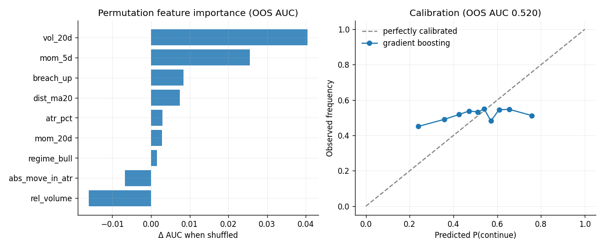
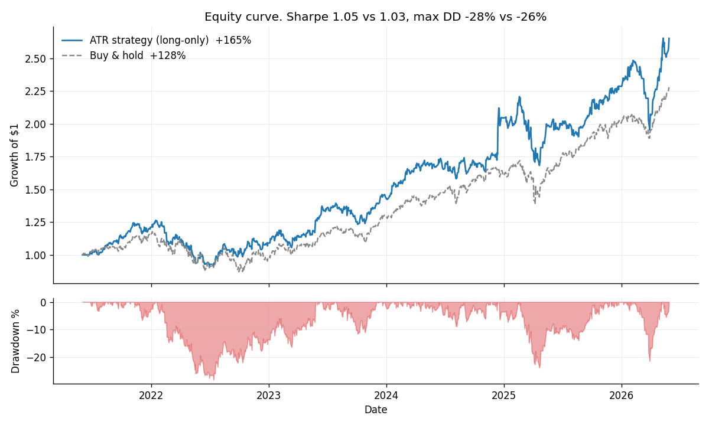
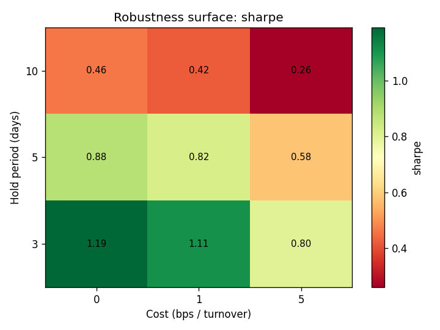
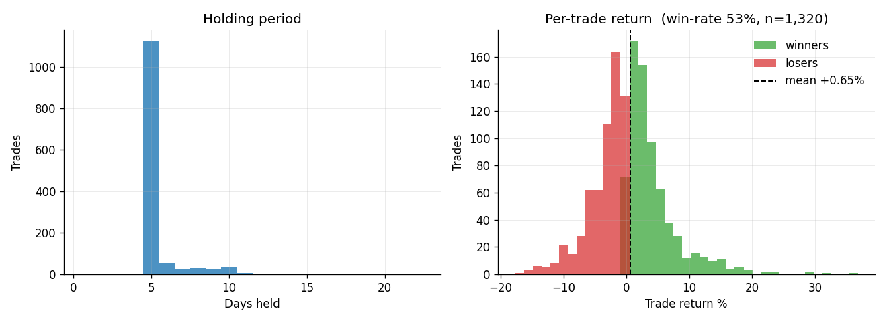

# ATR Breach Signal - Daily Research Memo

*Generated 2026-05-31 16:47 UTC - data 2021-06-01 to 2026-05-29 - 56 tickers - git `11a2212`*

## 1. Executive summary

- ATR breaches have beaten the random-date baseline (51.6% vs 50.1% 5-day hit-rate, 3,084 events).
- The event study is regime-dependent: continuation in bull regimes, mean reversion in bear regimes. That is why long/short is muted and long-only is the cleaner use case.
- Parameter sweep: Sharpe is positive in 100.0% of 9 parameter cells (stability 2.29). Shorter holds work better.
- Long-only vs buy & hold: +165% vs +128% total (Sharpe 1.05 vs 1.03). Most of that is still market beta, so the signal is best treated as a timing overlay.
- *Findings conditional on this universe and the 2021-2026 period. Use `python main.py walk-forward` for the out-of-sample view.*

## 2. Today's actions (2026-05-29)

```
Market regime: BULL.  Post-breach behaviour: momentum/continuation
Expected 3-day drift in breach direction: +0.33%  (90% band +0.19%..+0.48%, n=2,089)

  ticker  breach      ATR  exp move  action
  IBM     bullish     3.9    +0.33%  watch for upside follow-through [news-confirmed]
  ORCL    bullish     2.6    +0.33%  watch for upside follow-through [news-confirmed]
  MSFT    bullish     2.1    +0.33%  watch for upside follow-through [news-confirmed]
  CRM     bullish     2.0    +0.33%  watch for upside follow-through [news-confirmed]
  ADBE    bullish     2.0    +0.33%  watch for upside follow-through [news-confirmed]
  COST    bearish    -1.8    -0.33%  watch for downside follow-through, caution on longs [news-confirmed]
```

## 3. Signal behaviour - event study


The blended curve is small and front-loaded (half the 10-day move reached by day 2). The split matters more than the blended line: in bull regimes (n~2,100) breaches tend to continue; in bear regimes (n~897) they tend to fade after the first couple of days. Those effects offset each other in a long/short book.

### Machine-learning benchmark



A continuation classifier was tested walk-forward (2,746 out-of-sample predictions, base rate 51.7%). Best OOS AUC 0.520; the simple regime rule (accuracy 0.530) is competitive with the best ML model (accuracy 0.517). Top features: vol_20d, mom_5d, breach_up. The model does not add enough to justify using it as the main decision rule.

## 4. Performance



| Construction | Total | CAGR | Sharpe | Max DD | Invested |
|---|---:|---:|---:|---:|---:|
| Long/short | +43.5% | +7.5% | 0.58 | -14.5% | 98% |
| Long-only | +165.3% | +21.6% | 1.05 | -28.2% | 93% |
| Buy & hold | +127.9% | +18.0% | 1.03 | -26.0% | 100% |

## 5. Robustness



Sharpe across the hold x cost grid:

| hold (d) | cost (bps) | total % | CAGR % | Sharpe | max DD % |
|---:|---:|---:|---:|---:|---:|
| 3 | 0 | +138.3 | +19.1 | 1.19 | -15.0 |
| 3 | 1 | +124.4 | +17.6 | 1.11 | -15.2 |
| 3 | 5 | +76.2 | +12.1 | 0.80 | -16.0 |
| 5 | 0 | +76.5 | +12.1 | 0.88 | -13.2 |
| 5 | 1 | +69.3 | +11.2 | 0.82 | -13.5 |
| 5 | 5 | +43.5 | +7.5 | 0.58 | -14.5 |
| 10 | 0 | +26.9 | +4.9 | 0.46 | -23.6 |
| 10 | 1 | +23.9 | +4.4 | 0.42 | -24.2 |
| 10 | 5 | +12.8 | +2.5 | 0.26 | -26.5 |

## 6. Execution quality



- 2,698 discrete trades; win-rate 49%; mean per-trade +0.19%; avg hold 5.1 days.
- 5,083 turnover events over 1,255 days; invested 98% of the time.

## 7. Data provenance

- Data: 70,280 daily bars, 2021-06-01 to 2026-05-29, 56 tickers.
- Params: ATR(14), breach >= 1.5 ATR, horizons [1, 5], baseline seed 42.
- Full machine-readable manifests in `results/*_manifest.json`; every number here is reproducible via `python main.py verify`.

## 8. Validation layer

- Breach results are compared with a seeded random-date baseline.
- `walk-forward` trains on past years and tests on the next year.
- The event study reports bull and bear regimes separately.
- The portfolio simulator enters after the breach bar and includes costs.
- `verify` checks data integrity, P&L reconstruction, and determinism.
- `outcomes` compares logged decisions with realized returns.